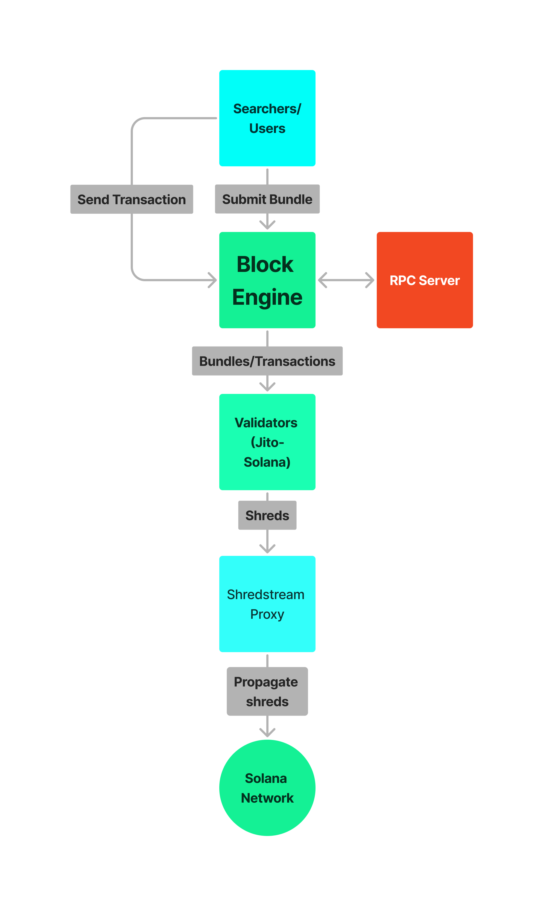

# Overview
The Shred-Decoding Library is a high-performance tool designed to decode shreds (data fragments) from the Solana blockchain network. It provides a faster and more efficient way to receive transactions compared to traditional methods like gRPC Geyser.

additional details can be found on GitHub: https://github.com/jito-labs/shredstream-proxy.
# Key Advantage
- Faster Transaction Receipt: The library leverages direct shred parsing logic, enabling it to receive transactions more quickly than gRPC Geyser.

# How It Works

Validators (such as those running Jito-Solana) generate shreds from incoming transactions.
The library receives these shreds directly and decodes them using optimized parsing logic.


# How to Run
1. Configure Environment Variables
- Copy the .env.example file to .env
```env
cp .env.example .env
```
- Environment Variables Explanation:
    - BLOCK_ENGINE_URL: The URL of the block engine you want to connect to, e.g., https://frankfurt.mainnet.block-engine.jito.wtf.
    - AUTH_KEYPAIR: The path to the authentication keypair JSON file, e.g., keypair.json.
    - DESIRED_REGIONS: A comma-separated list of regions to connect to, e.g., frankfurt,amsterdam,ny.
    - NUM_THREADS: The number of threads for processing, with a minimum of 4.
    - BIND_ADDR: The address the server binds to, e.g., 127.0.0.1 for local.
    - BIND_PORT: The port the server binds to, e.g., 20000.

2. Run the Program

```shell
RUST_LOG=info cargo run --release
```

# Disclaimer
Use this at your own risk.


The developers are not responsible for any issues, losses, or risks that may arise from using this library. Please ensure you understand its functionality and have appropriate safeguards in place before integrating it into your projects.